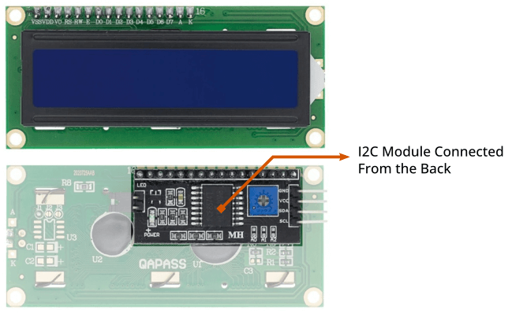
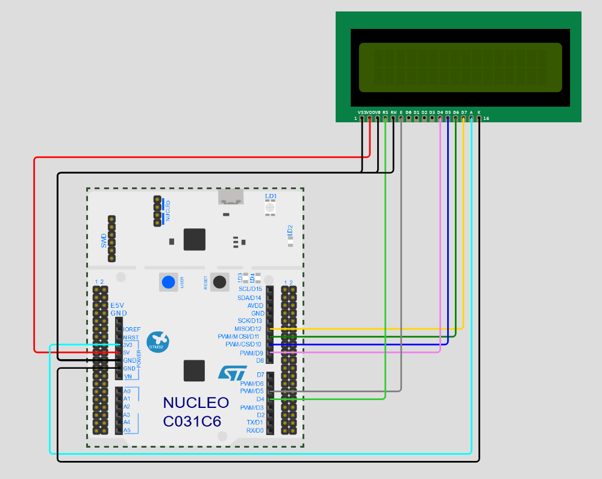
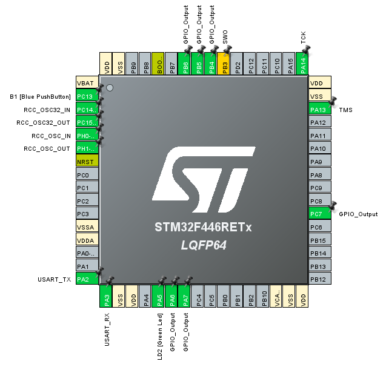
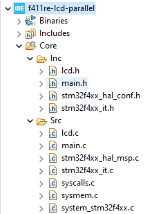

# Connecting LCD Display with Nucleo Board 

>Content in this page is referenced from Nizar Mohideen’s tutorials on MicroPeta. For more information, visit https://www.micropeta.com/video60"


## LCD Display Types
- **LCD with I2C Module:** This type of display uses fewer pins and simplifies wiring.

    

- **LCD without I2C Module:** This type requires more pins.

## Project Setup
- **Pin Labeling and Wiring Diagram:**


- **Detailed Wiring**
   
    | LCD | Nucleo-F446RE |
    | --- | -----------: |
    | VSS | GND |
    | VDD | 5V |
    | V0 | GND |
    | RS | D4 |
    | RW | GND |
    | E | D5 |
    | D0 | NC |
    | D1 | NC |
    | D2 | NC |
    | D3 | NC |
    | D4 | D9 |
    | D5 | D10 |
    | D6 | D11 |
    | D7 | D12 |
    | A | 3.3V |
    | K | GND |

## STM32CubeIDE Setup

  - **Selecting the Nucleo Board:** Choose the Nucleo F446RE board.
  - **Naming the Project:** Demonstrate naming the project (e.g., `lcd`).
  - **Peripheral Initialization:** Configure the GPIO pins (PA6, PA7, PC7, PB4, PB5, PB6) for output.

    

## Code Implementation
- **Include Necessary Files:**
  - **`lcd.h` File:**
    - **Copying Code:** Download the file from the library folder.
    - Drag-and-drop the `lcd.h` file to Core/Inc folder.
  
  - **`lcd.c` File:**
    - **Copying Code:** Download the file from the library folder.
    - Drag-and-drop the `lcd.c` file to Core/Src folder.

    

- **Modifications in `main.c`:**
  - **Include Headers:** Insert the necessary include line.

    ```C
    /* USER CODE BEGIN Includes */
    #include "lcd.h"
    /* USER CODE END Includes */
    ```
  - **User Code Sections:** Copy and paste code into the user-defined sections.

    ```C
    /* USER CODE BEGIN 2 */
    // Lcd_PortType ports[] = { D4_GPIO_Port, D5_GPIO_Port, D6_GPIO_Port, D7_GPIO_Port };
    Lcd_PortType ports[] = { GPIOC, GPIOB, GPIOA, GPIOA };
    // Lcd_PinType pins[] = {D4_Pin, D5_Pin, D6_Pin, D7_Pin};
    Lcd_PinType pins[] = {GPIO_PIN_7, GPIO_PIN_6, GPIO_PIN_7, GPIO_PIN_6};
    Lcd_HandleTypeDef lcd;
    // Lcd_create(ports, pins, RS_GPIO_Port, RS_Pin, EN_GPIO_Port, EN_Pin, LCD_4_BIT_MODE);
    lcd = Lcd_create(ports, pins, GPIOB, GPIO_PIN_5, GPIOB, GPIO_PIN_4, LCD_4_BIT_MODE);
    Lcd_cursor(&lcd, 0,3);
    Lcd_string(&lcd, "ST IoT Lab");
    for ( int x = 1; x <= 200 ; x++ )
    {
        Lcd_cursor(&lcd, 1,7);
        Lcd_int(&lcd, x);
        HAL_Delay (1000);
    }
    /* USER CODE END 2 */

    ```

## Compilation and Upload
- **Save and Generate Code:** 
- **Uploading Code to Nucleo Board:** 

## Adjusting Display Brightness**
- **Display Clarity Issue:** The problem of unclear display from different angles.
- **Solution with Potentiometer:**
  - **Adding Potentiometer:** Add a potentiometer to adjust brightness.
  - **Wiring Instructions:**
    - **Connection to Ground and 3.3V:** Connect one side to the ground and the other to 3.3V.
    - **Middle Pin Connection:** Connect the middle pin to adjust the brightness.
  
### Slide 11: Conclusion
  - **Configured LCD**: Successfully configured LCD pin as output.
  - **Code Implementation**: Wrote code to display onan LED.
  - **Project Deployment**: Compiled and flashed the code, verifying functionality.